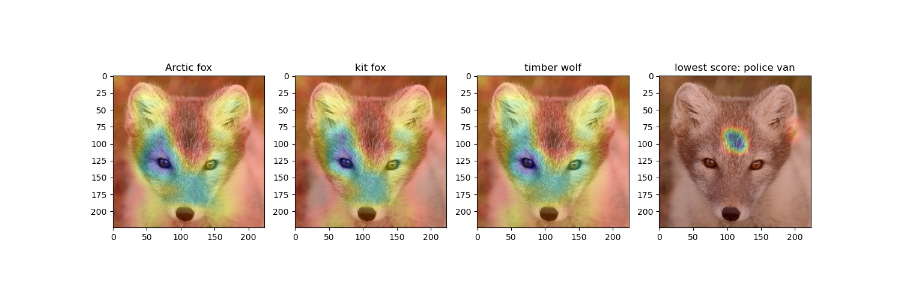
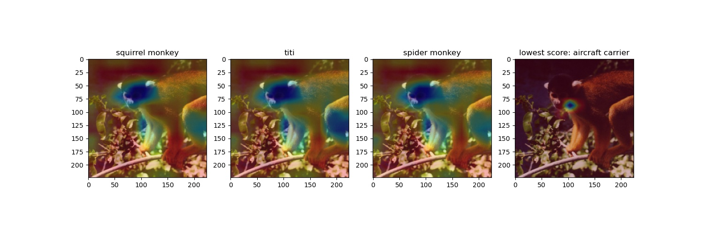
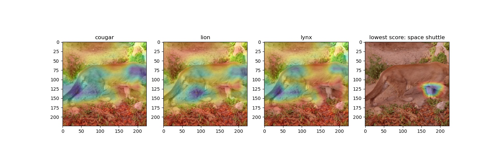

# GradCam to better understand your network
This git is a user friendly implementation of GradCam to better understand the behaviour of any CNN-based computer vision network.
Paper at: https://arxiv.org/pdf/1610.02391

The input needed is the pre-trained network in question, and at least one image to be used for inference. The last layer is visualized since it contains highest level of information.
The output is a superposition of the image and a heatmap indicating where the CNN layer is looking.

Example to run:

`python main.py --model_path vgg16 --images_path data --labels_path imagenet1000_labels.txt --n_images 3 --show`

1. **model_path**: path to torch saved model (using torch.save()).
2. **conv2d_backcount**: CNN layer to visualize, counting from behind
3. **images_path**: path pointing to the root of the images folder (not to the directory containing the images, but one level before).
4. **save_dir**: directory to save images on which gradcam was applied.
5. **n_images**: number of images used for inference.
6. **imageNet_labels**: add --imageNet_labels if labels used are from ImageNet.
7. **show**: add --show in command to show plots of GradCam. By default, plots will not be shown.
8. **labels_path**: path to .txt file containing a dictionary of your labels in the following format:

    {0: 'cat',                        
     1: 'dog',                        
     2: 'person'}
 
 --labels_path not needed if --imageNet_labels flag is used.
 
 <ins>Example of figures obtained:</ins>

 We always show the top three predictions and the worst prediction.
 
 
 
 

